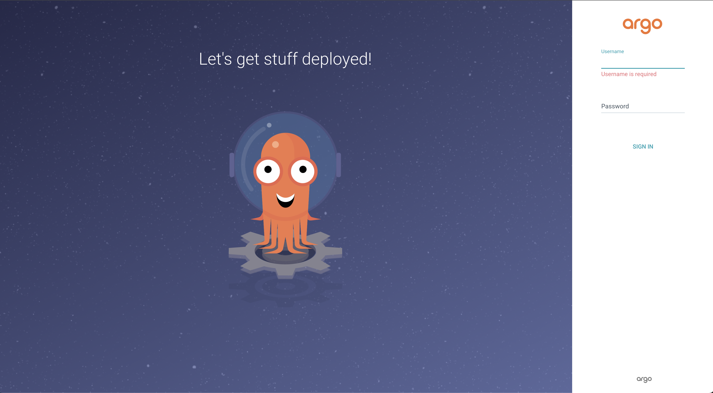
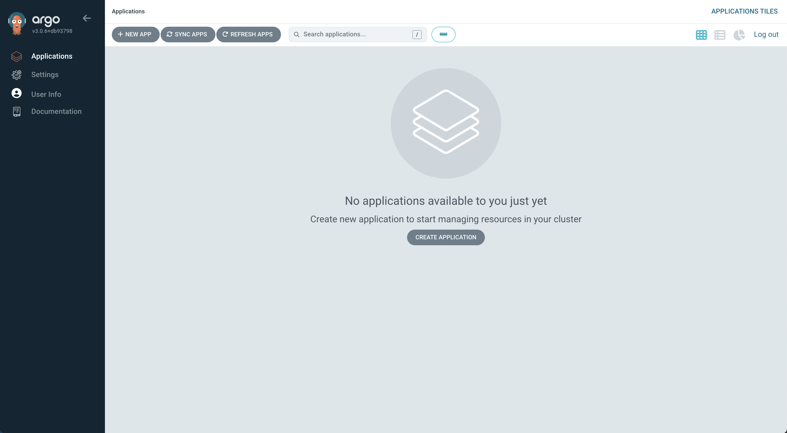

# Встановлення ArgoCD на k3d


## 1. Створення k3d кластера
```bash
k3d cluster create argocd-poc \
  --api-port 6443 \
  --port "8090:80@loadbalancer" \
  --port "8443:443@loadbalancer" \
  --agents 2
```

## 2. Встановлення ArgoCD
```bash
kubectl create namespace argocd
kubectl apply -n argocd -f https://raw.githubusercontent.com/argoproj/argo-cd/stable/manifests/install.yaml
```

## 3. Очікування готовності
```bash
kubectl wait --for=condition=available deployment -n argocd argocd-server --timeout=300s
```

## 4. Налаштування доступу
### Отримання паролю адміністратора
```bash
kubectl -n argocd get secret argocd-initial-admin-secret -o jsonpath="{.data.password}" | base64 -d; echo
```
###  Порт-форвардінг
```bash
kubectl port-forward svc/argocd-server -n argocd 8090:443
```
## 5. Логін через UI
Відкрийте у браузері:
http://localhost:8080

Логін: admin

Пароль: (з кроку 4)



